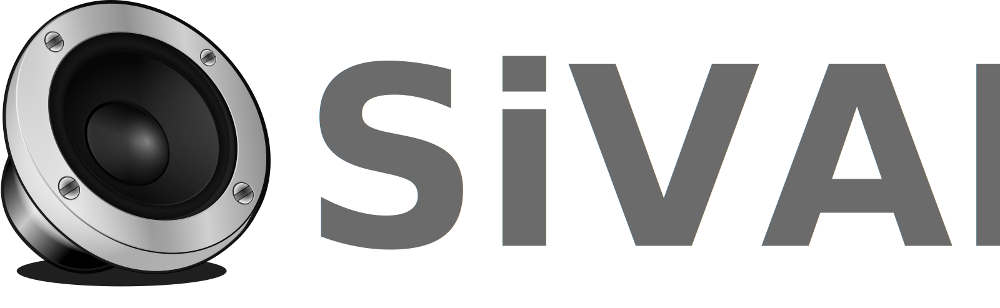

# SiVAL
Simulation, Visualisation and Analysis Software for Loudspeaker

This application is a comprehensive software solution for DIY builders. It serves as a powerful platform for the **simulation, visualization, and analysis of loudspeaker systems**, streamlining the often complex process of enclosure design. Our goal is to empower users by providing a dedicated environment to manage driver data, predict performance, and bring their audio projects to life with precision and confidence.

